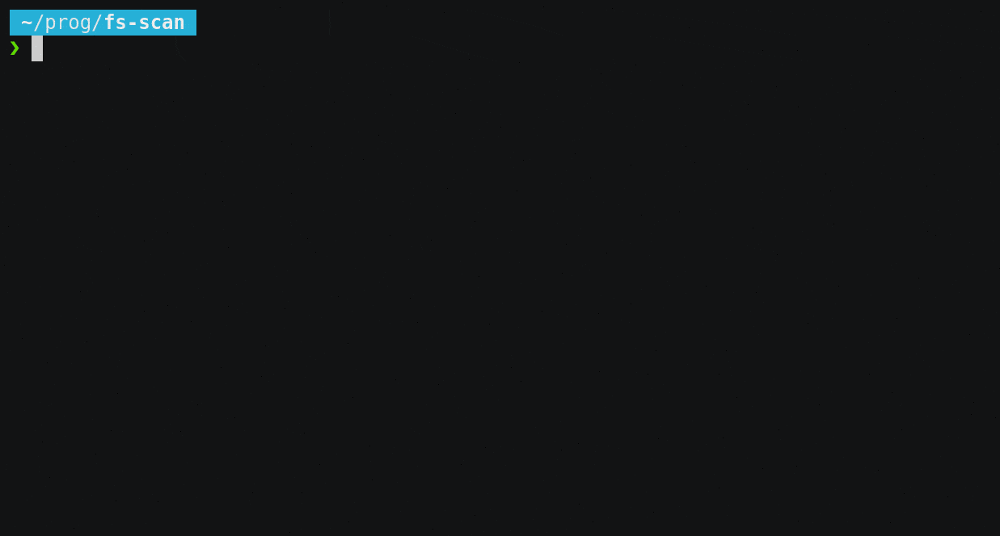

# fs-scan
Scan directory and sub directories to display file layout from the size standpoint.



The package can optionally take a parameter which will be used as base directory.
Otherwise the current directory is used.


In the current path:

```sh
$ ~/bin/fs-scan 
Files -> 642K (642896)
Directories -> 62K (62645)
Less than 4K -> 377K (377699)
Between 4K and 16K -> 168K (168241)
...
```

To a specify the path:

```sh
$ ~/bin/fs-scan bench-fs/
The path is bench-fs/
Files -> 642K (642896)
Directories -> 62K (62645)
Less than 4K -> 377K (377699)
Between 4K and 16K -> 168K (168241)
...
```

## Export results

Additionally the result is sent to a `fs-scan_output.csv`.
Multiple run can be done from the same directory to collect outputs from multiple directories in a single file.

```sh
fs-scan dir1 && fs-scan dir2
```

CSV files are easy to use and import into spreadsheets.